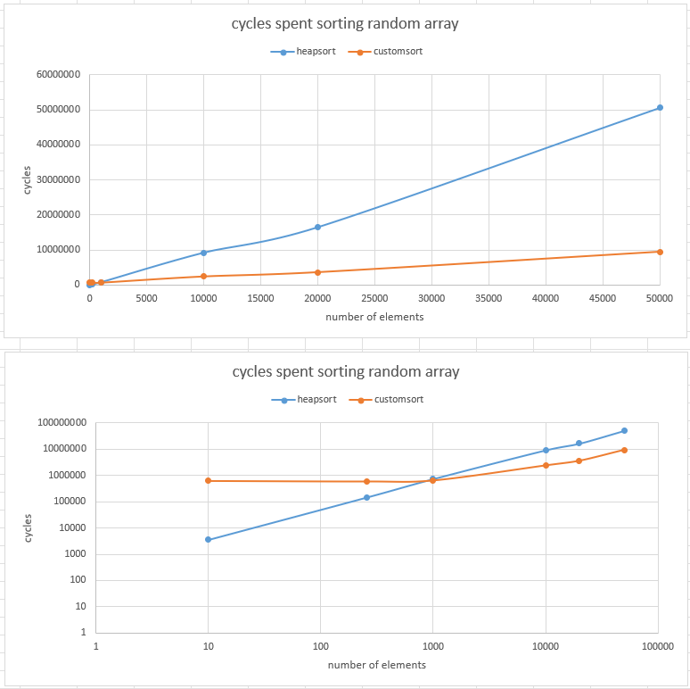

## Task definition:
1. Write a command line application in highly-portable C or C++ that reads an array of new-line separated numbers from a text file, and writes the sorted array to another file. Input values range between 1 and 50000, and the length is variable but up to 50000. There are no duplicate values in the input. Implement the sorting function yourself (signature: void xsort(const uint16_t* input, size_t size, uint16_t* output). Optimize it for performance, but as a second priority keep  xsort  stack frame size minimal (ideally, below 10KB). For simplicity, assume that input and output buffers never overlap.
1. Implement a unit tests suite for xsort. You can use a unit testing framework of your choice.
1. Implement a build script (preferably in Make or CMake, but other build systems are ok too).
1. Host the code as a private git repository (preferably on GitHub). Add README with build, test, and usage instructions.  

## Test cases
- 10 random elements
- 256 random elements
- 1000 random elements
- 10000 random elements
- 50000 random elements
- 50000 sorted elements
- 50000 reverse sorted
- 50000 few unique elements

## How to test that array is sorted
1. Count and compare the number of elements in input and output file.
1. Sum up all elements in input file and compare result with sum of elements in output file.
2. Go through all elements in output file and make sure that each next element is bigger or equal to previous one.

## Sorting algoritm selection
With the Performance target in mind only **O(n*log(n))** sorting algoritms are suitable for this task ([Time Complexities of all Sorting Algorithms](https://www.geeksforgeeks.org/time-complexities-of-all-sorting-algorithms/)) such as Quick Sort, Heap Sort and Merge Sort. Tacking into accoun additional stack frame size limitation Heap Sort becomes an obvious choise, but it becomes higly inefficienct 

1. Heap sort implementation.

1. Custom algorithm:
	- Iterate through array finding values from 1 to 50000
	- When value found, add it to current cell in output array and increment output pointer
	- Use availiable stack space to create dictionary to decrease the number of iteration through input array

1. Custom algorithm not compliant with set requirements:
	- Prefills input array cells with amount of items with value equal cell number in input stream online (as soon as they are received)
	- Go through input array from cell 0 to 50000, as soon as non zero value is reached, fill the next **value**-amount of output array cells with **input cell number**

## Performance testing
Following figure shows impelemented algorithm performance with optimal dictionary size of 4096 (to compliy with stack frame size limitation) and with no compiler optimization (-O0)



## Repository content
```
../
├───data_in		- input files with unsorted values
├───data_out		- output files with sorted values
├───src			- source files for sorting algorithm
├───test		- source files for unit tests
└───unity		- Unity Test unit testing framework files https://github.com/ThrowTheSwitch/Unity
```

## How to compile, run, test


### Compile and run unit test for xsort

```
make test
```
* Under Windows, depening on configuration it might be required to use "mingw32-make test" instead of "make test"

Expected terminal output:
```
Unity test run 1 of 1
TEST(ProductionCode, xsortFunction_10RandomElements) PASS
TEST(ProductionCode, xsortFunction_256RandomElements) PASS
TEST(ProductionCode, xsortFunction_1000RandomElements) PASS
TEST(ProductionCode, xsortFunction_10000RandomElements) PASS
TEST(ProductionCode, xsortFunction_50000RandomElements) PASS
TEST(ProductionCode, xsortFunction_50000AlreadySortredElements) PASS
TEST(ProductionCode, xsortFunction_50000ReverseSortedElements) PASS
TEST(ProductionCode, xsortFunction_50000FewUniqueElements) PASS

-----------------------
8 Tests 0 Failures 0 Ignored
OK
```


### Compile and run implementation
```
make

xsort_file data_in/sorted_random_50000.txt data_out/sorted_random_50000_sorted.txt
```
Expected terminal output:
```
Cycles spent, 5287228 
```
After execution output file with sorted array will be created under specified path.
